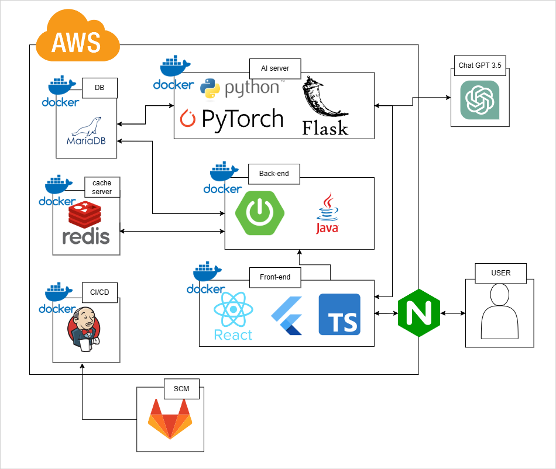
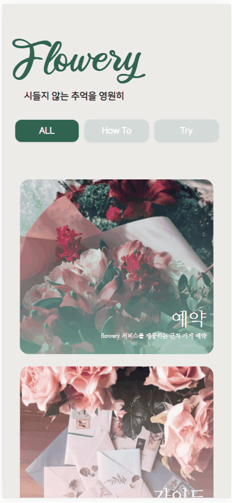
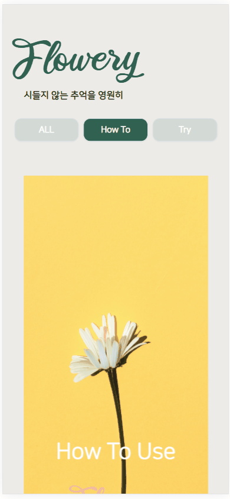
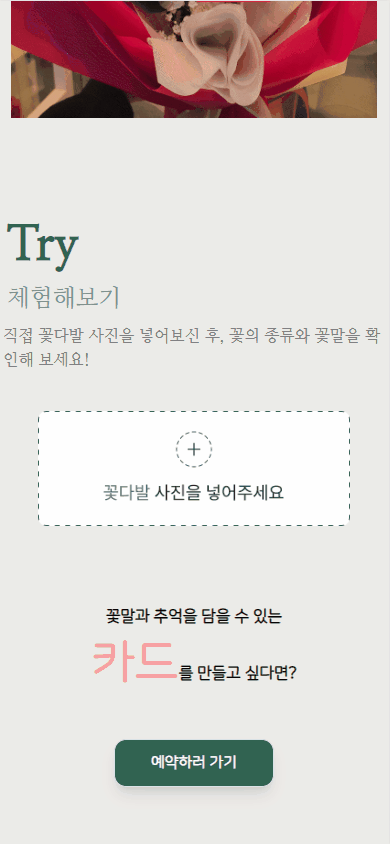
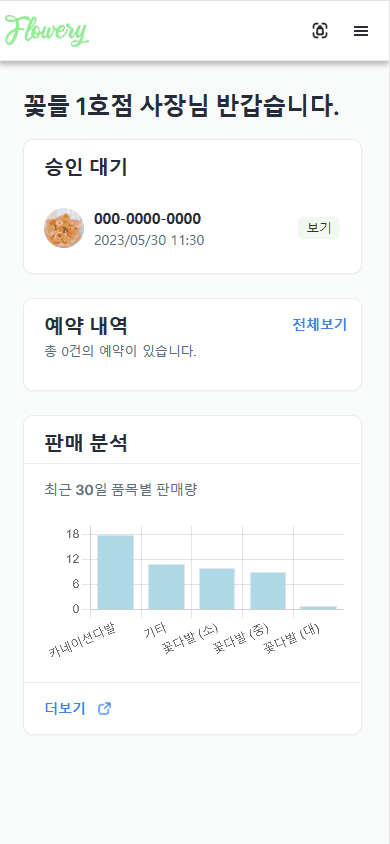
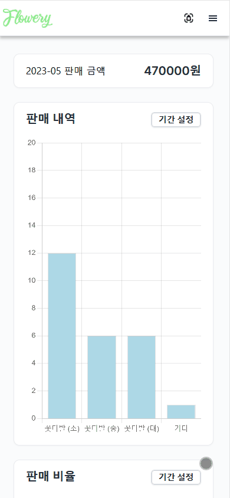
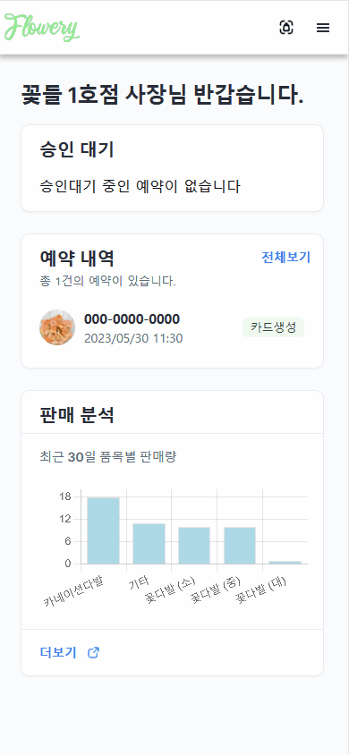
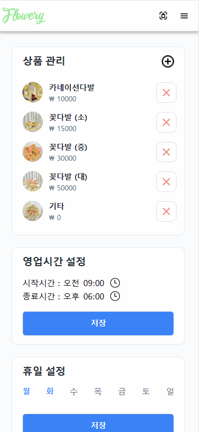
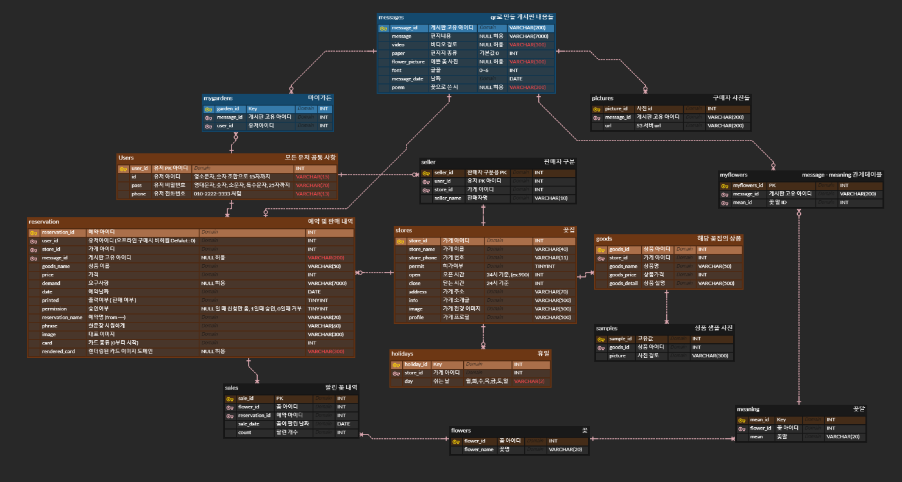

# Flowery 소개

## 🏆 삼성 청년 SW 아카데미 - 자율 프로젝트 우수상 수상

**꽃은 시들어도 Flowery는 영원히**

`Flowery`는 꽃집을 대상으로 AI, 모바일 웹을 이용한 판매자 및 구매자를 위한 새로운 서비스를 제공하는 프로젝트입니다.

구매자 입장에서는 배달의 민족과 같이 꽃집 소개, 예약, 꽃에 메시지를 담아 QR코드로 저장하여 꽃과 동봉되는 카드를 통해 추억을 기억할 수 있습니다.

판매자 입장으로는 꽃다발을 제작 후 AI를 이용한 다중 객체 인식으로 꽃의 개수, 종류를 구분하여 판매 기록 관리 등의 서비스를 제공합니다.

## 0️⃣ 프로젝트 실천 및 기획 배경

### 기획배경
>**꽃집은 매우 불규칙적인 판매 구조를 가지고 있어서 IT 기술을 접목하기 어렵습니다.**
>
>**실제로 IT 솔루션이 많이 진출하지 않은 분야고 그렇기에 반대로 가능성이 있는 시장이라고 판단 하여 프로젝트를 진행하였습니다.**

### 프로젝트 실천
>**해당 프로젝트는 기획 과정에서 부산 서면, 양산에 위치한 꽃집의 사장님, 직원 분들과 3차례의 인터뷰를 통해 개선점 및 수요를 조사하여 서비스를 기획하였습니다.**
>
>**실제로 부산 강서구 삼성 전기 및 서면에 위치한 꽃집에서 각각 6시간 서비스 제공하였고 구글폼을 이용한 피드백을 바탕으로 기능을 수정하였습니다.**

## 1️⃣ 프로젝트 정보

### 프로젝트 목표
⭐ 실제 꽃집의 서비스적 수요와 요구사항을 조사하여 새로운 서비스를 구축하기

⭐ 서비스를 **실현**시켜 실제 꽃가게에서 서비스 제공하기

### 프로젝트 기간 4.10(월) ~ 5.19(금) (6주)

### 프로젝트 참여 인원
| 팀원명 | 담당 포지션  |
| --- | --- |
| *** | BE / AI |
| *** | BE |
| *** | BE |
| *** | FE |
| *** | FE |
| *** | FE |

## 🖥️ 시스템 아키텍쳐

## 구매자 페이지

### 메인 페이지

### 이미지 객체 인식 체험 기능

### 예약 기능

### 메시지 작성

### 메시지 확인 페이지

## 판매자 페이지

### 판매자 메인페이지, 예약 수락, 거절 기능

### 판매 내역 확인

### 꽃다발 이미지 인식 및 카드 제작

### 판매 상품 관리

## ERD

